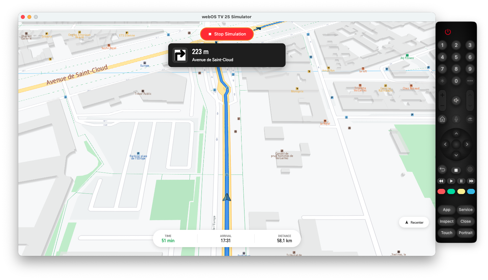

## Overview

This example app demonstrates the following features:
- Display a map on a webOS device.
- Calculate a route (Paris area) and display it on the map.
- Start a turn-by-turn navigation simulation with live instruction updates.
- Custom position tracker icon with navigation arrow.

<p align="center">
  
</p>

## Prerequisites

- [Node.js](https://nodejs.org/) (v18 or later)
- [webOS CLI tools (`ares-*`)](https://webostv.developer.lge.com/develop/tools/cli-installation) installed and on your PATH
- webOS Simulator **or** a developer-mode webOS device

### Installing the webOS SDK and CLI

1. Download the [webOS SDK](https://webostv.developer.lge.com/develop/tools/sdk-introduction) from the LG developer portal.
2. Install the SDK, which includes the CLI tools (`ares-setup-device`, `ares-package`, `ares-install`, `ares-launch`, etc.) and the Simulator.
3. Verify installation:

    ```sh
    ares-setup-device --version
    ```

## Build instructions

1. Set your API token in `src/token.ts`:

    ```typescript
    export const GEMKIT_TOKEN = "your_api_token";
    ```

2. Install dependencies:

    ```sh
    npm install
    ```

3. Build the app:

    ```sh
    npm run build
    ```

    This produces a production bundle in the `dist/` directory.

## Running on the webOS Simulator

1. **Launch the Simulator.** Open the webOS Simulator from the LG webOS SDK (or run it directly from its install path). Note the simulator version number (e.g. `25`).

2. **Launch the app directly from `dist/`.** Provide the path to your webOS Simulator installation (e.g. `~/Downloads/webOS_TV_25_Simulator_1.4.4`):

    ```sh
    ares-launch -s 25 -sp ~/Downloads/webOS_TV_25_Simulator_1.4.4 ./dist
    ```

    | Flag | Meaning |
    |------|---------|
    | `-s <version>` | Simulator platform version (e.g. `25`) |
    | `-sp <path>` | Path to the simulator installation directory |
    | `./dist` | The built app directory to launch |

    Adjust `-s` and `-sp` to match your installed simulator version and location. See the [ares-launch documentation](https://webostv.developer.lge.com/develop/tools/cli-dev-guide) for all available options.

## Running on a physical webOS device

> **Note:** The IPK workflow (`ares-package` / `ares-install` / `ares-launch`) is primarily for physical devices.

1. Enable [Developer Mode](https://webostv.developer.lge.com/develop/getting-started/developer-mode-app) on your device.
2. Register the device:

    ```sh
    ares-setup-device
    ```

3. Package, install, and launch:

    ```sh
    ares-package --no-minify ./dist
    ares-install --device <your-tv-name> com.magiclane.typescript.routesimulation_1.0.0_all.ipk
    ares-launch --device <your-tv-name> com.magiclane.typescript.routesimulation
    ```

## Using the app

- **Build Route** - calculates a driving route in the Paris area.
- **Start Simulation** - begins the turn-by-turn navigation simulation along the main route.
- **Stop Simulation** - stops the simulation and clears the route.
- **Recenter** - re-centers the map on the current simulated position.
- Press **Back** on the remote to exit.
